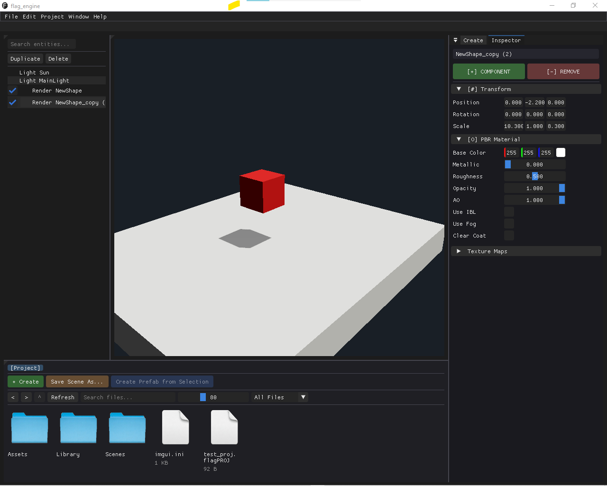
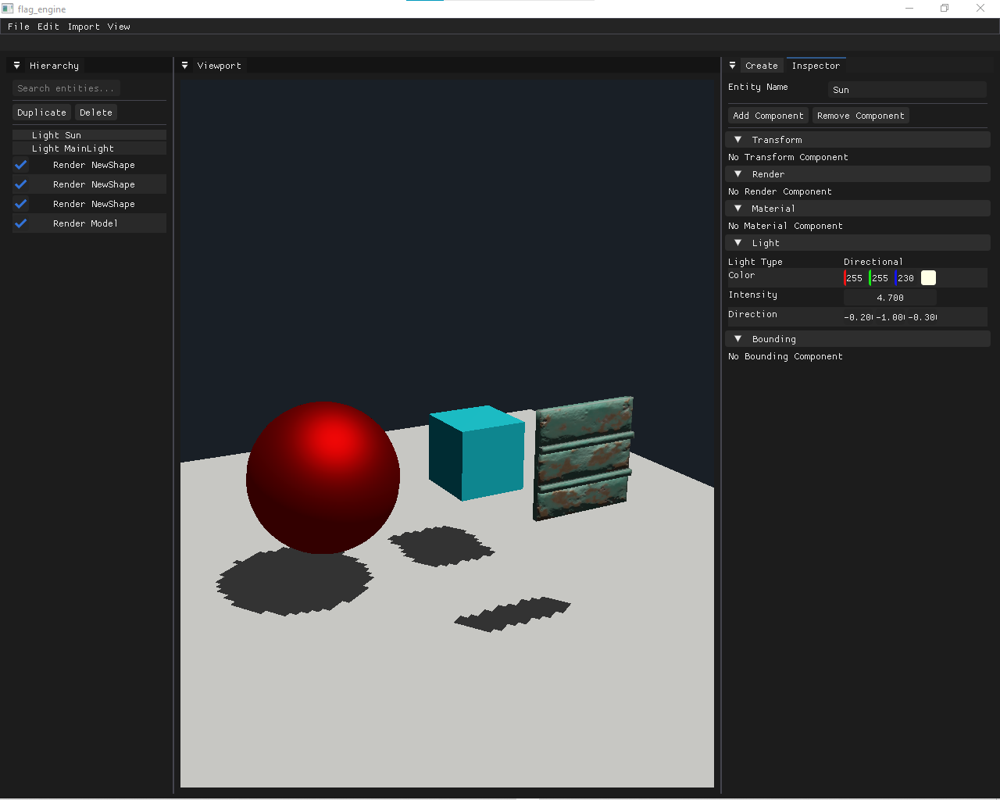

# Flag Engine | Custom C++/OpenGL 3D Renderer

Flag Engine is a high-performance 3D rendering engine built from the ground up using **C++** and **OpenGL 4.x**. This project focuses on implementing a modern, physically-based graphics pipeline and providing a robust testing ground for technical art and shader development.

## 🚀 Key Technical Features

### 1. PBR Rendering Pipeline
* **Metallic/Roughness Workflow:** Implements the Cook-Torrance BRDF for realistic material interaction.
* **Lighting:** Supports dynamic Directional and Point lights with real-time intensity and color modulation.
* **Shadows:** Cascaded Shadow Mapping (CSM) for optimized high-resolution shadows across large view distances.

### 2. Custom Shader Library
* **Procedural Dissolve:** An alpha-discard shader with dynamic emissive borders, driven by noise-map sampling.
* **Tech Art Integration:** Ability to hot-swap shaders and manipulate material properties in real-time.

### 3. Core Architecture
* **Vertex Attribute Layouts:** Optimized buffer management for high-speed mesh data transfer to the GPU.
* **ImGui Debug Suite:** Real-time GUI for tweaking light positions, shader parameters, and engine performance metrics.
* **Modular Asset Loading:** Clean abstraction for loading OBJ/FBX models with associated PBR texture maps.

## 🛠️ Tech Stack
* **Language:** C++17
* **API:** OpenGL 4.x (Glad/GLFW)
* **Math:** GLM
* **UI:** Dear ImGui
* **Models/Assets:** Blender, Photoshop

## 📸 Media & Breakdowns
*(Insert your screenshots here)*

### **Dissolve Shader Demo**
> This demo showcases the discard logic and the emissive edge calculation.

### **PBR Integration**
> Showcasing accurate reflections and light distribution on hard-surface models.

## 🏗️ Future Roadmap
- [ ] Implement Forward+ Lighting
- [ ] Add SSAO (Screen Space Ambient Occlusion)
- [ ] Integration of a custom Physics Solver

---
*Developed by a 16-year-old Technical Artist & Engine Developer passionate about graphics programming.*
